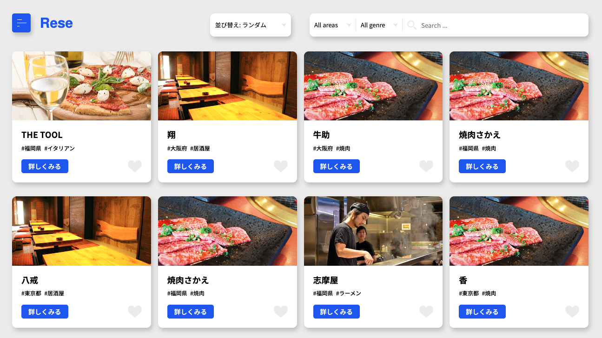
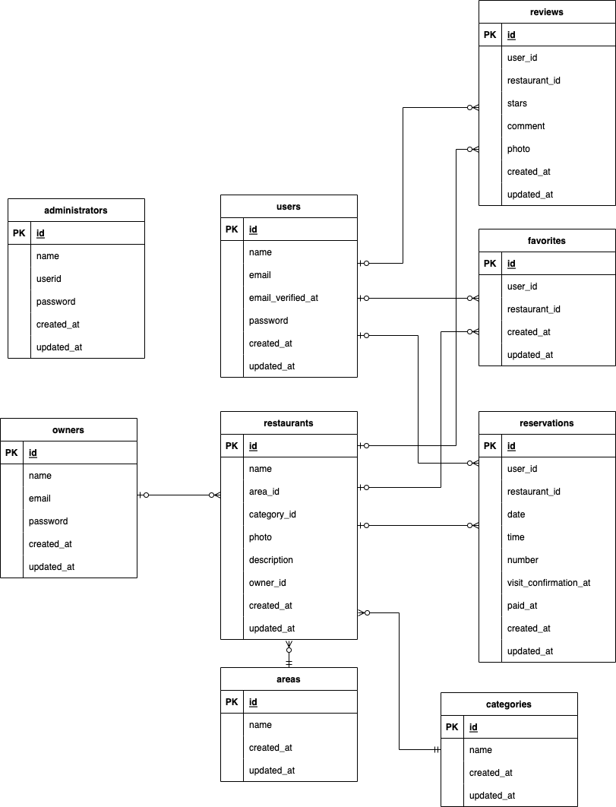

# Rese

## 概要
飲食店予約サービス  



## 作成した目的
- 自社の飲食店予約サービスを開発し、サービス手数料がかからないようにする
- 従来より魅力的なサービスを作成し、ユーザー数を増やす

## アプリケーションURL
http://localhost

## 他のリポジトリ
なし

## 機能一覧
| 機能名 | 説明 |
|-----------|-----------|
| ユーザー登録 | ユーザー情報を登録する。 |
| ユーザーログイン | Eメールとパスワードで認証し、ユーザー権限でログインする。 |
| ユーザーログアウト | ユーザー権限のログイン状態を解除する。 |
| ユーザーEメール認証 | ユーザーの登録したEメールアドレスに認証用URLを送付し、Eメール認証を行う。 |
| ユーザー情報取得 | ユーザー名、予約情報、お気に入り店舗情報を取得する。 |
| ユーザー店舗お気に入り一覧取得 | ユーザーがお気に入り登録した店舗の一覧を取得する。 |
| ユーザー店舗予約情報取得 | ユーザーの予約情報を取得する。 |
| ユーザーEメール認証 | ユーザーに認証用URLのついたメールを送信し、Eメール認証を行う。 |
| 店舗一覧取得 | 登録済みの店舗の一覧情報を取得する。 |
| 店舗詳細取得 | 各店舗の詳細情報を取得する。 |
| 店舗お気に入り追加 | 店舗のお気に入り情報を追加する。 |
| 店舗お気に入り削除 | 店舗のお気に入り情報を削除する。 |
| 店舗予約情報追加 | 店舗の予約情報を追加する。同時に来店確認のためのQRコードを発行し、それを添付した予約確認メールをユーザーに送信する。 |
| 店舗予約情報削除 | 店舗の予約情報を削除する。 |
| 店舗予約情報更新 | 店舗の予約情報を更新する。 |
| エリアで検索する | 店舗一覧画面でエリアによる絞り込みを行う。 |
| ジャンルで検索する | 店舗一覧画面でジャンルによる絞り込みを行う。 |
| キーワードで検索する | 店舗一覧画面でキーワードによる絞り込みを行う。 |
| 店舗一覧ソート（ランダム） | 選択するたびに店舗のランダム順で表示。 |
| 店舗一覧ソート（評価が高い順） | 口コミの評価が高い順に店舗をソートする。※口コミが存在しない店舗は最後尾 |
| 店舗一覧ソート（評価が低い順） | 口コミの評価が低い順に店舗をソートする。※口コミが存在しない店舗は最後尾 |
| 口コミ一覧取得 | 各店舗の口コミ一覧情報を取得する。 |
| 口コミ追加 | ユーザーが店舗に対し、口コミを追加する。 |
| 口コミ編集 | ユーザーが自身の投稿した口コミを編集する。 |
| 口コミ削除（ユーザー） | 店舗詳細画面または口コミ一覧画面にて、ユーザーが自身の投稿した口コミを削除する。|
| 口コミ削除（管理者） | 口コミ一覧画面にて、管理者が任意の口コミを削除する。|
| クーポン購入 | 予約後に、来店時に使えるクーポンをStripe決済で購入する。 |
| 管理者ログイン | ユーザーIDとパスワードで認証し、管理者権限でログインする。 |
| 管理者ログアウト | 管理者権限のログイン状態を解除する。 |
| 店舗代表者登録 | 店舗代表者情報を登録する。 |
| 店舗代表者一覧取得 | 登録済みの店舗代表者の一覧情報を取得する。 |
| 店舗代表者ログイン | Eメールとパスワードで認証し、店舗代表者権限でログインする。 |
| 店舗代表者ログアウト | 店舗代表者権限のログイン状態を解除する。 |
| 店舗情報登録 | 店舗代表者が店舗情報を登録する。 |
| 店舗情報更新 | 店舗代表者が店舗情報を更新する。 |
| 店舗予約情報一覧取得 | 予約の一覧情報を取得する。 |
| お知らせメール送信 | 店舗代表者が予約ユーザーに対しお知らせメールを送信する。 |
| 予約情報リマインダーメール送信 | 予約当日の朝にユーザーにリマインダーメールを自動送信する。 |
| 来店照合 | ユーザーの来店時に、予約時にユーザーに発行したQRコードを店側で照合する。 |
| CSV登録 | 管理者が管理画面から店舗情報のCSVファイルをアップロードし、店舗情報を一括登録する。 |


## 使用技術(実行環境)
- PHP 8.2.15
- Laravel 8.83.27
- MySQL 8.0.26
- nginx 1.21.1

## テーブル設計

### usersテーブル
| カラム名 | 型 | PRIMARY KEY | UNIQUE KEY | NOT NULL | FOREIGN KEY |
|------|------|------|------|------|------|
| id | unsigned bigint | ◯ | ◯ | ◯ |  |
| name | varchar(255) |  |  | ◯ |  |
| email | varchar(255) |  |  | ◯ |  |
| email_verified_at | timestamp |  |  |  |  |
| password | varchar(255) |  |  | ◯ |  |
| created_at | timestamp |  |  |  |  |
| updated_at | timestamp |  |  |  |  |

### restaurantsテーブル
| カラム名 | 型 | PRIMARY KEY | UNIQUE KEY | NOT NULL | FOREIGN KEY |
|------|------|------|------|------|------|
| id | unsigned bigint | ◯ | ◯ | ◯ |  |
| name | varchar(255) |  |  | ◯ |  |
| area_id | unsigned bigint|  |  | ◯ | areas(id) |
| category_id | unsigned bigint	|  |  | ◯ | category(id) |
| photo | varchar(255) |  |  | ◯ |  |
| description | text |  |  | ◯ |  |
| owner_id | unsigned bigint|  |  |  | owner(id) |
| created_at | timestamp |  |  |  |  |
| updated_at | timestamp |  |  |  |  |

### areasテーブル
| カラム名 | 型 | PRIMARY KEY | UNIQUE KEY | NOT NULL | FOREIGN KEY |
|------|------|------|------|------|------|
| id | unsigned bigint | ◯ | ◯ | ◯ |  |
| name | varchar(255) |  |  | ◯ |  |
| created_at | timestamp |  |  |  |  |
| updated_at | timestamp |  |  |  |  |

### categoriesテーブル
| カラム名 | 型 | PRIMARY KEY | UNIQUE KEY | NOT NULL | FOREIGN KEY |
|------|------|------|------|------|------|
| id | unsigned bigint | ◯ | ◯ | ◯ |  |
| name | varchar(255) |  |  | ◯ |  |
| created_at | timestamp |  |  |  |  |
| updated_at | timestamp |  |  |  |  |

### reservationsテーブル
| カラム名 | 型 | PRIMARY KEY | UNIQUE KEY | NOT NULL | FOREIGN KEY |
|------|------|------|------|------|------|
| id | unsigned bigint | ◯ | ◯ | ◯ |  |
| user_id | unsigned bigint |  |  | ◯ | users(id) |
| restaurant_id | unsigned bigint |  |  | ◯ | restaurants(id) |
| date | date |  |  | ◯ |  |
| time | time |  |  | ◯ |  |
| number | int |  |  | ◯ |  |
| visit_confirmation_at | datetime |  |  |  |  |
| paid_at | datetime |  |  |  |  |
| created_at | timestamp |  |  |  |  |
| updated_at | timestamp |  |  |  |  |

### favoritesテーブル
| カラム名 | 型 | PRIMARY KEY | UNIQUE KEY | NOT NULL | FOREIGN KEY |
|------|------|------|------|------|------|
| id | unsigned bigint | ◯ | ◯ | ◯ |  |
| user_id | unsigned bigint |  |  | ◯ | users(id) |
| restaurant_id | unsigned bigint |  |  | ◯ | restaurants(id) |
| created_at | timestamp |  |  |  |  |
| updated_at | timestamp |  |  |  |  |

### reviewsテーブル
| カラム名 | 型 | PRIMARY KEY | UNIQUE KEY | NOT NULL | FOREIGN KEY |
|------|------|------|------|------|------|
| id | unsigned bigint | ◯ | ◯ | ◯ |  |
| user_id | unsigned bigint |  |  | ◯ | users(id) |
| restaurant_id | unsigned bigint |  |  | ◯ | restaurants(id) |
| stars | int |  |  | ◯ |  |
| comment | text |  |  | ◯ |  |
| photo | varchar(255) |  |  |  |  |
| created_at | timestamp |  |  |  |  |
| updated_at | timestamp |  |  |  |  |

### administratorsテーブル
| カラム名 | 型 | PRIMARY KEY | UNIQUE KEY | NOT NULL | FOREIGN KEY |
|------|------|------|------|------|------|
| id | unsigned bigint | ◯ | ◯ | ◯ |  |
| name | varchar(255) |  |  | ◯ |  |
| userid | varchar(255) |  |  | ◯ |  |
| password | varchar(255) |  |  | ◯ |  |
| created_at | timestamp |  |  |  |  |
| updated_at | timestamp |  |  |  |  |

### ownersテーブル
| カラム名 | 型 | PRIMARY KEY | UNIQUE KEY | NOT NULL | FOREIGN KEY |
|------|------|------|------|------|------|
| id | unsigned bigint | ◯ | ◯ | ◯ |  |
| name | varchar(255) |  |  | ◯ |  |
| email | varchar(255) |  |  | ◯ |  |
| password | varchar(255) |  |  | ◯ |  |
| created_at | timestamp |  |  |  |  |
| updated_at | timestamp |  |  |  |  |

## ER図


## 環境構築
### Dockerビルド
1. `git clone git@github.com:chie-ichi/protest.git`
2. `docker-compose up -d --build`

＊ MySQLは、OSによって起動しない場合があるのでそれぞれのPCに合わせてdocker-compose.ymlファイルを編集してください。

### Laravel環境構築
1. `docker-compose exec php bash`
2. `composer install`
3. .env.exampleファイルから.envを作成し、環境変数を変更
4. `php artisan key:generate`
5. `php artisan migrate`
6. `php artisan db:seed`
7. `php artisan storage:link`

＊ Stripeによる支払い機能を動作させるため、手順3で.envファイルにStripeの公開可能キー・シークレットキーを以下の形式で記述してください。
```
STRIPE_KEY=公開可能キー
STRIPE_SECRET=シークレットキー
```

＊ Mailtrapを使用してメール送信の動作確認を行うため、手順3で.envファイルにメールの設定を以下のように記述してください。
```
MAIL_MAILER=smtp
MAIL_HOST=sandbox.smtp.mailtrap.io
MAIL_PORT=2525
MAIL_USERNAME=ユーザー名
MAIL_PASSWORD=パスワード
MAIL_ENCRYPTION=tls
MAIL_FROM_ADDRESS=example@example.com
MAIL_FROM_NAME="${APP_NAME}"
```

### テスト環境構築
1. `docker exec -it [MySqlコンテナID] bash`
2. `mysql -u root -p`  
パスワード(docker-compose.ymlファイルのMYSQL_ROOT_PASSWORDの値)を入力してログイン
3. `CREATE DATABASE test_laravel_db;`
4. `SHOW DATABASES;`  
test_laravel_dbという名前のデータベースがきちんと作成されていることを確認
5. `exit`
を2回実行し、MySQLコンテナへの接続を終了
6. `cd src`
7. `cp .env .env.testing`
を実行して.envをコピーして.env.testingファイルを作成
8. .env.testingの冒頭部分を編集
```
APP_ENV=local
APP_KEY=キー
```
↓
```
APP_ENV=test
APP_KEY=
```
9. .env.testingにデータベースの接続情報をテスト用に編集
```
DB_DATABASE=laravel_db
DB_USERNAME=laravel_user
DB_PASSWORD=laravel_pass
```
↓
```
DB_DATABASE=test_laravel_db
DB_USERNAME=root
DB_PASSWORD=root
```
10. `docker-compose exec php bash`
11. `php artisan key:generate --env=testing`
12. `php artisan config:clear`
13. `php artisan migrate --env=testing`
14. `php artisan db:seed --env=testing`

## テストアカウント
テストアカウント情報は以下の通り。  
※以下のユーザーは上記のLaravel環境構築作業の手順6を行うと生成される。

### ユーザーアカウント
| 名前 | Eメール | パスワード |
|-----------|-----------|-----------|
| 田中一郎 | test1@test.jp | password1 |
| 田中二郎 | test2@test.jp | password2 |
| 田中三郎 | test3@test.jp | password3 |
| 田中四郎 | test4@test.jp | password4 |
| 田中五郎 | test5@test.jp | password5 |
| 田中六郎 | test6@test.jp | password6 |
| 田中七郎 | test7@test.jp | password7 |
| 田中八郎 | test8@test.jp | password8 |
| 田中九郎 | test9@test.jp | password9 |
| 田中十郎 | test10@test.jp | password10 |

### 管理者アカウント
| 名前 | ユーザーID | パスワード |
|-----------|-----------|-----------|
| 管理者1 | admin1 | password1 |
| 管理者2 | admin2 | password2 |
| 管理者3 | admin3 | password3 |

### 店舗代表者アカウント
| 名前 | Eメール | パスワード |
|-----------|-----------|-----------|
| 店舗代表者1 | owner1@test.jp | password1 |
| 店舗代表者2 | owner2@test.jp | password2 |
| 店舗代表者3 | owner3@test.jp | password3 |
| 店舗代表者4 | owner4@test.jp | password4 |
| 店舗代表者5 | owner5@test.jp | password5 |
| 店舗代表者6 | owner6@test.jp | password6 |
| 店舗代表者7 | owner7@test.jp | password7 |
| 店舗代表者8 | owner8@test.jp | password8 |
| 店舗代表者9 | owner9@test.jp | password0 |
| 店舗代表者10 | owner10@test.jp | password10 |
| 店舗代表者11 | owner11@test.jp | password11 |
| 店舗代表者12 | owner12@test.jp | password12 |
| 店舗代表者13 | owner13@test.jp | password13 |
| 店舗代表者14 | owner14@test.jp | password14 |
| 店舗代表者15 | owner15@test.jp | password15 |
| 店舗代表者16 | owner16@test.jp | password16 |
| 店舗代表者17 | owner17@test.jp | password17 |
| 店舗代表者18 | owner18@test.jp | password18 |
| 店舗代表者19 | owner19@test.jp | password19 |
| 店舗代表者20 | owner20@test.jp | password20 |

## 管理者アップロード用CSVファイルについて

### 構成概要
- 1行目はヘッダーとして"name,area_name,category_name,description,photo_url,owner_id"を入力
- 2行目以降はヘッダーに合わせて情報を入力。各項目の詳細については次節を参照のこと。

### 項目詳細
| ヘッダー名 | 入力値 | 例 |
|-----------|-----------|-----------|
| name | 店舗名：50文字以内 | ラーメン田中 |
| area_name | 地域名：「東京都」「大阪府」「福岡県」のいずれか | 大阪府 |
| category_name | ジャンル名：「寿司」「焼肉」「イタリアン」「居酒屋」「ラーメン」のいずれか | ラーメン |
| description | 店舗概要：400文字以内 | こだわりの素材を使用した自家製の麺と、じっくり煮込んだ特製スープが自慢のラーメン店です。 |
| photo_url | 画像URL：jpeg,jpg,pngのみ | https://coachtech-matter.s3-ap-northeast-1.amazonaws.com/image/ramen.jpg|
| owner_id | 店舗代表者ID：登録済みの店舗代表者のIDを整数で指定 | 1 |

### CSVファイル例
```
name,area_name,category_name,description,photo_url,owner_id
ラーメン福,大阪府,ラーメン,こだわりの素材を使用した自家製の麺と、じっくり煮込んだ特製スープが自慢のラーメン店です。醤油、味噌、塩など多彩な味わいをお楽しみいただけます。心温まる一杯を提供するため、毎日丹精込めてラーメンを作り上げています。居心地の良い空間で、至福のひとときをお過ごしください。皆様のご来店を心よりお待ちしております。,https://coachtech-matter.s3-ap-northeast-1.amazonaws.com/image/ramen.jpg,2
焼肉さかえ,福岡県,焼肉,厳選された新鮮な和牛を使った本格炭火焼肉をお楽しみいただけるお店です。秘伝のタレと絶妙な焼き加減で、肉の旨味を最大限に引き出します。アットホームな雰囲気の中、家族や友人と一緒に最高の焼肉体験をお楽しみください。特製デザートや豊富なドリンクメニューもご用意しております。,https://coachtech-matter.s3-ap-northeast-1.amazonaws.com/image/yakiniku.jpg,15
リストランテ・ベルデ,東京都,イタリアン,本場イタリアの味をお届けする本格イタリアンレストランです。新鮮な食材と伝統的な調理法で作られるパスタやピザは絶品。ワインセレクションも豊富で、料理とのペアリングをお楽しみいただけます。落ち着いた雰囲気の中で、大切な人との特別な時間をお過ごしください。皆様のご来店を心よりお待ちしております。,https://coachtech-matter.s3-ap-northeast-1.amazonaws.com/image/italian.jpg,9
```


## 申し送り事項

### メール送信を伴う機能について
Mailtrap (https://mailtrap.io/) を使用したテスト送信でのみ動作確認済みです。

### 決済機能について
Stripeのテスト環境およびテストカードを用いて動作確認済みです。
Stripeのテストカードの情報については以下をご参照ください。
https://docs.stripe.com/testing?locale=ja-JP

### AWSについて
今回の入会テストにつきまして、AWSへのデプロイは行っておりません。
動作確認はローカル環境で行っていただけると幸いです。